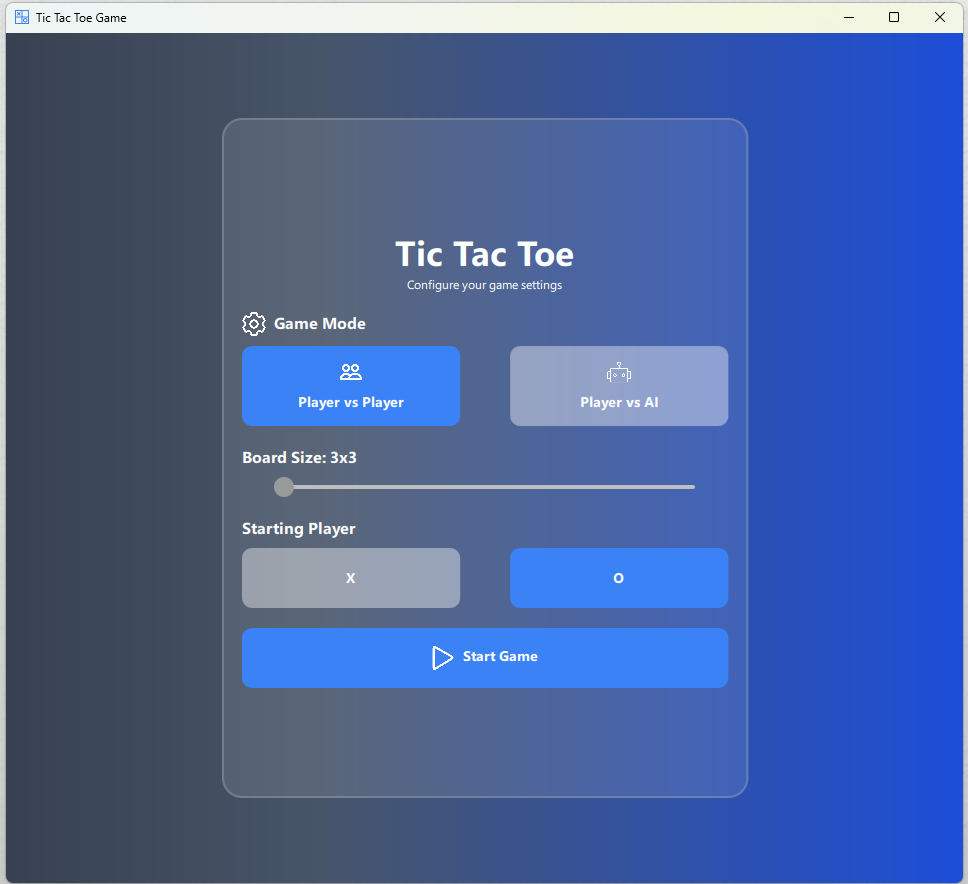
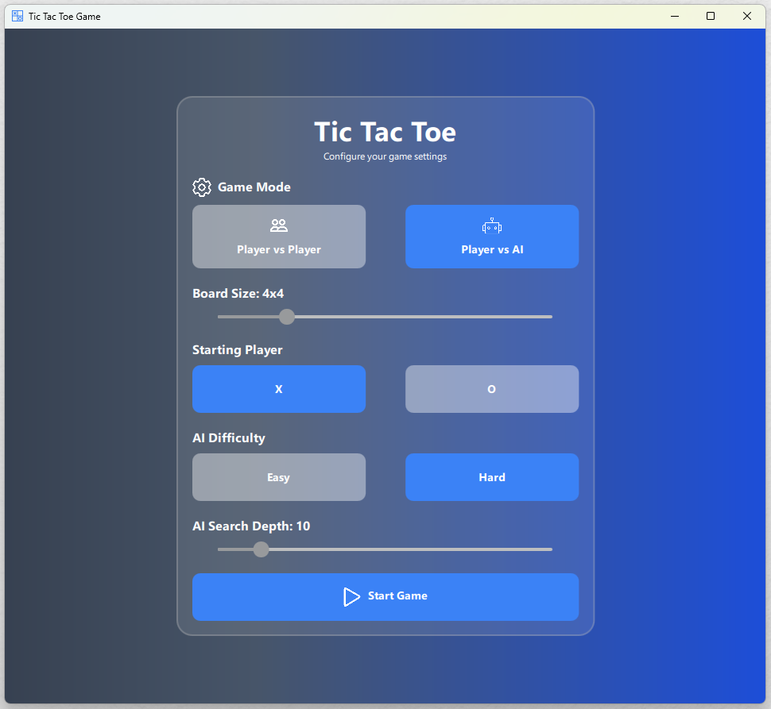
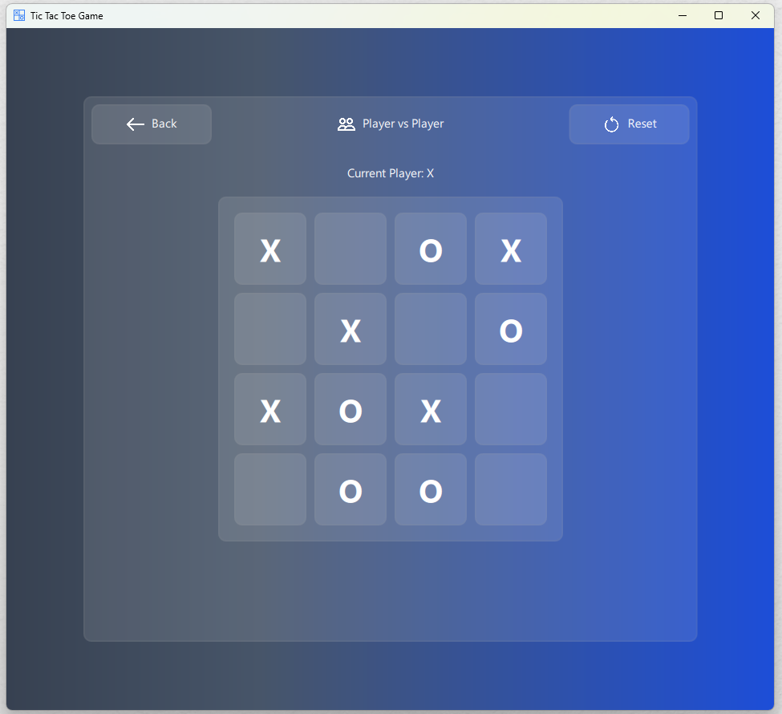

# Tic Tac Toe with AI

A cross-platform **C++ Tic Tac Toe game** with a modern **Qt/QML UI** and AI opponent (random & minimax).  
Built with **CMake, Qt6, GoogleTest**, and packaged via **GitHub Actions CI/CD**.

> ℹ️ **Note:** A **console version** of the game (text-based) is also available in the branch [`console_version`](https://github.com/AmraniMohammed/tic_tac_toe/tree/console_version).

---

## ✨ Features

- Local two-player mode
- One-player vs AI:
  - Easy (random)
  - Hard (minimax algorithm)
- Qt/QML interface with polished visuals
- Highlighting of winning lines
- Restart & menu navigation
- Separation of **core game logic** (`Board`, `AIPlayer`) from **UI layer**
- Automated builds, tests, and packaging via CI/CD

---

## 📂 Repository Layout

```
TicTacToe/
├── src/
│ ├── Core/ # Core logic (Board, AIPlayer, GameTypes)
│ ├── Wrapper/ # GameManager bridge to QML
│ ├── UI/ # QML interface files
│ └── main.cpp
├── tests/ # GoogleTest unit tests
├── docs/ # Screenshots and demo assets
└── CMakeLists.txt
```

---

## 🚀 Quick Build & Run (Qt6 QML UI)

1. Ensure Qt 6 is installed with your preferred compiler (MSVC or MinGW).
2. Open terminal or Developer Command Prompt.
3. Create and enter a build folder:

```bash
mkdir build
cd build
```

4. Run CMake and provide the Qt6 path:

```bash
cmake .. -DCMAKE_PREFIX_PATH="C:/Qt/6.X.X/mingw_64/lib/cmake"
cmake --build .
```

5. Run the app:

```bash
./src/appTicTacToe.exe
```

**Requirements:** C++17 compiler, CMake 3.31+, Qt 6+, (Optional) GoogleTest.

---

## Running tests (GoogleTest + CTest)

```bash
cd build
cmake --build .
ctest --test-dir .
```

---

## 📸 Screenshots:

- **Startup window:**

  

  

- **Game window:**

  

- 🎥 **Video demo:**  
  [Watch demo video](https://drive.google.com/file/d/1IvyxHMo5QUc-CaR227afCUwTQ1cmD9NW/view?usp=sharing)

---

## 🛠 Development Process (Agile Sprints)

### ✅ Sprint 0

- Implemented 3×3 board
- Handled two-player turn logic
- Built basic console display
- Added game state evaluation (win/draw)
- Implemented simple AI (random moves)

### ✅ Sprint 1

- Core components: `Board`, `GameManager`, `AIPlayer`
- Minimax AI (hard mode) + random AI (easy mode)
- Winner evaluation with draw detection
- Basic unit tests for `Board::evaluateWinner()`

### ✅ Sprint 2

- Qt/QML GUI implementation
- `GameManager` QObject wrapper for QML
- Expanded test coverage
- CI/CD pipeline (GitHub Actions) for build, test & packaging
- Features: difficulty selector, restart button, winning line highlight
- Packaged executable as `.zip` artifact

### ✅ Sprint 3

- Refined UI for end-of-game states
- Improved UX (restart/menu handling)
- Documentation & demo assets (screenshots + video)

## 🎮 Download

You can download the latest packaged version of the game from the [Releases page](https://github.com/AmraniMohammed/tic_tac_toe/releases).

## Future TODOs / Nice-to-Have Features

These are explored but not yet implemented:

- Alpha–beta pruning in `AIPlayer::miniMaxAlgo` for faster AI
- Visual polish: animations, transitions, or sounds
- Networking support for two-player mode over LAN or Internet
- Score tracking

---
